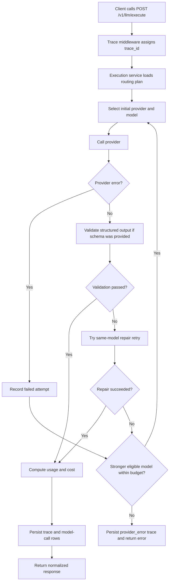
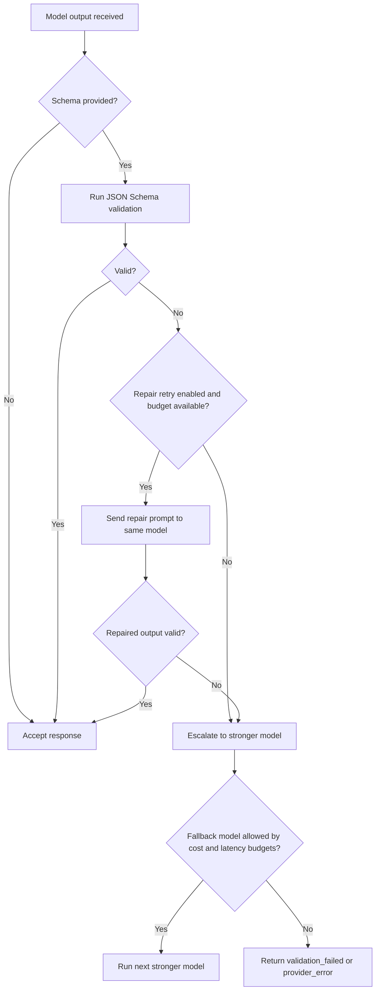
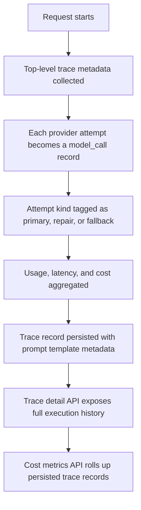

# LLM Gateway

Production-oriented gateway scaffold for standardized LLM execution, routing, validation, tracing, and eval workflows.

We keep the changelog and the flowcharts in this README updated as the system evolves so the current behavior stays understandable without reading the whole codebase.

## Current Status

This repository currently includes:

- FastAPI service scaffold
- request trace middleware
- health endpoint
- `POST /v1/llm/execute` endpoint with mock and OpenAI-compatible provider paths
- rule-based routing for `cost_optimized`, `balanced`, `quality_optimized`, and explicit model selection
- same-model repair retry for structured-output validation failures before escalating to a stronger model
- fallback to stronger models when provider errors or repair attempts still fail within budget
- `GET /v1/traces/{trace_id}` endpoint for trace inspection
- `GET /v1/metrics/cost` endpoint for cost rollups
- configuration system
- trace persistence models and Alembic migration
- Docker Compose for Postgres
- starter tests

## Quick Start

1. Create a virtual environment and install dependencies from `pyproject.toml`.
2. Copy `.env.example` to `.env`.
3. Start local infra with `docker-compose up -d`.
4. Run database migrations with `alembic upgrade head`.
5. Run the API with `uvicorn app.main:app --reload`.
6. Run tests with `pytest`.

The bundled Postgres container is exposed on `localhost:5433` to avoid clashing with local Postgres installs that commonly use `5432`.

## OpenAI Provider

The gateway keeps `mock` as the default provider so the project stays runnable without external API access.

To exercise the live OpenAI path:

1. Set `OPENAI_API_KEY` in `.env`.
2. Either set `DEFAULT_PROVIDER=openai_compatible` or send `"provider": "openai_compatible"` in the request body.
3. Optionally set `OPENAI_DEFAULT_MODEL` to the model you want to use.

## Routing and Fallback

Current routing policies:

- `cost_optimized`
- `balanced`
- `quality_optimized`
- `explicit_model`

Current fallback behavior:

- If a provider call fails, the gateway can retry on a stronger eligible model.
- If structured output fails schema validation, the gateway first tries one repair retry on the same model.
- If the repair attempt still fails, the gateway can escalate to a stronger eligible model.
- Fallback attempts stop when cost or latency budget would be exceeded.

## Prompt Versioning

`POST /v1/llm/execute` now accepts optional prompt metadata:

- `prompt_template_name`
- `prompt_template_version`

Those values are persisted on the top-level trace so you can tie outcomes, cost, and reliability back to the exact prompt contract that produced them. Repair attempts are also marked in trace detail as `attempt_kind = "repair"`.

## Flowcharts

These diagrams are meant to stay in sync with the current implementation.

### Execute Request Flow

### Reliability Recovery Flow

### Trace Persistence Flow

## API Endpoints

- `GET /healthz`
- `GET /v1/meta`
- `POST /v1/llm/execute`
- `GET /v1/traces/{trace_id}`
- `GET /v1/metrics/cost`
